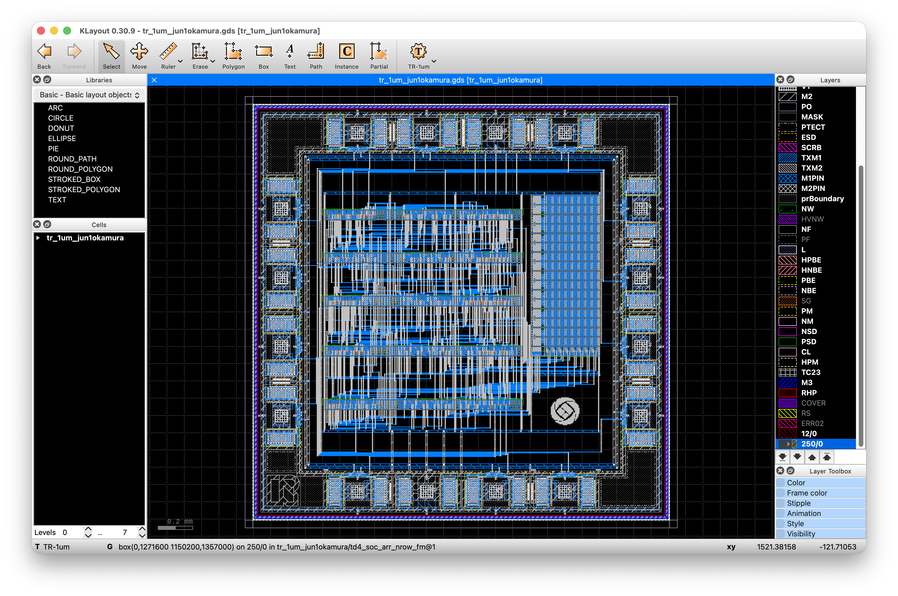

# TD4 4-bit CPU on TR-1um (IP62)

[](../../actions/workflows/check.yml)

TD4 — the 4-bit CPU from『CPUの創りかた』— laid out end to end on the
**OpenSUSI TR-1um (IP62)** 1 µm CMOS open PDK, for the 2.5 × 2.5 mm MPW shuttle.

The program memory is a **writable 16 × 8 bit register array**, not a ROM, so
the chip can be reprogrammed over its own pins: hold `EXEC` low and clock the
instructions in nibble by nibble, then raise `EXEC` and it runs.



*`src/tr_1um_jun1okamura.gds`. The pad ring runs around the outside; inside it
the five standard-cell rows fill the left, the 16 × 8 bit memory macro stands
on the right, and the ring channel between the core and the pads carries the
14 signals plus the VDD and GND rings. The OpenSUSI mark, bottom right, is
646 isolated M2 dots.*

| | |
|---|---|
| Die | 2,500 × 2,500 µm (`OSS_FRAME`, 16 bond pads) |
| Core | 1,604.7 × 1,357.0 µm, 5 rows + a 16 × 8 bit macro |
| Process | TR-1um / IP62, 1 µm CMOS, 5 V, **M1 + M2 only** |
| Devices | 4,225 (chip, extracted) |
| Clock | verified at 10 MHz; STA `reg→reg` 63.09 ns (15.85 MHz) |
| Status | **DRC clean / LVS match / ngspice PASS** |

> ### The tools now live in `TR-1um_APRtools`
>
> The place-and-route, chip-assembly, DRC/LVS and characterisation scripts are
> no longer copied into each design. They are maintained in one place:
> [`jun1okamura/TR-1um_APRtools`](https://github.com/jun1okamura/TR-1um_APRtools) (`apr/`, with `apr/README.md` as the
> map). **If you want to build something new on TR-1um, start there.**
>
> What remains in `scripts/` here is design-specific (`config.py`, testbench
> stimulus, pad assignment), called directly by CI (`scripts/pre_check.py`,
> `scripts/read_info.py`), or kept as a record of the flow at submission time
> (APRtools also ships a read-only copy under `legacy/`).
> **Where a file name appears in both, only the APRtools one is maintained.**
>
> APRtools scripts are run with the design directory as the cwd; they take no
> arguments:
>
> ```sh
> export TR1UM_PDK=<where the PDK is>/TR-1um
> export APRTOOLS=<where the tools are>/TR-1um_APRtools
> export PYTHONPATH=$APRTOOLS/apr
> python3 $APRTOOLS/apr/selfcheck.py
> ```

---

## What is on the chip

```
          P1  CLK      P2  WR      P3  NIBSEL    P4..P7  D[3:0]
          P9  RSTN     P14 EXEC    P8  VSS       P16     VDD
          P10..P13  OUT[3:0]       P15 CF
```

`EXEC = 0` is **load mode**: each `WR` pulse writes one nibble of an
instruction into the next memory location (`NIBSEL` picks immediate / opcode),
and the load address auto-increments. `EXEC = 1` **runs** the program from
address 0.

Every pin's direction is fixed, so each pad's `HIZ` is tied straight to a rail
(inputs to VDD, outputs to GND) — the library has no `TIEHI`/`TIELO` cell.
Inputs are received by `BUFTH`, a Schmitt trigger, so a slow or noisy edge on
`CLK` or `RSTN` is cleaned up on the way in.

---

## MPW submission

```
info.yaml                        gds.top_cell = tr_1um_jun1okamura
src/tr_1um_jun1okamura.gds       the layout   (= layout/chip/step4_final.gds)
src/tr_1um_jun1okamura.cir       the netlist  (= LVS reference)
```

`scripts/pnr/export_mpw.py` copies those two files and re-checks what
`scripts/pre_check.py` checks first (exactly one top cell, the name in
`info.yaml`, dbu 0.001, the 2,500 µm die box, a frame cell present).

CI runs **Pre-check → DRC → LVS → MDP** on every push.

---

## How it was built

```
hdl/rtl/td4_soc_arr.v           RTL (iverilog + IRSIM + ngspice verified)
        │  yosys + scripts/tr1um.genlib
        ▼
out/td4_soc_arr_pnr.v           gate-level netlist
        │  scripts/pnr/  (place.py → route.py → step11)
        ▼
layout/step11/…_macro_power.gds core, 1,604.7 × 1,357.0 µm
        │  scripts/pnr/assemble_top.py … place_logo.py
        ▼
layout/chip/step4_final.gds     chip
```

### Core (`scripts/pnr/README.md`)

A from-scratch placer and router, because the PDK has **two metal layers** and
the usual open-source flows want three. Cells sit in rows 59.4 µm tall on a
5.4 µm site grid; M1 runs horizontally, M2 vertically, and every layer change
is a `via_1` PCell. The 16 × 8 bit macro `REG8x16` stands unrotated to the
right of a five-row stack, with an 8-track M2 bus down its side for `Q[7:0]`.

Result: **0 shorts, 0 DRC, LVS match** at 1,598.4 × 1,357.0 µm (the portrait
floorplan; the landscape one came out 1,611.0 × 1,643.8).

### Chip (`scripts/pnr/README.md`, chip section)

The core drops into the pad ring's 1,840 × 1,840 µm opening with 241.5 µm of
channel above and below and 117.65 µm left and right. Radii, from the outside
in:

```
921.7   pad terminals (P / HIZ / OUT) and the VSS wall pins
902.0   VDD ring     10 µm, M1 horizontal / M2 vertical
884.0   GND ring     same
810.0   signal lane 0, then 5.4 µm pitch — 14 nets fit in 6 lanes
802.35  the core
```

Keeping "horizontal is M1, vertical is M2" means the rings and the radial drops
are always perpendicular, so every crossing is M1 × M2 and a via appears only
where a connection is wanted.

### Verification

| | |
|---|---|
| DRC | KLayout, PDK runset — clean |
| LVS | KLayout, PDK runset — match (16 top pins / 4,225 devices / 1,503 nets) |
| ngspice | extracted netlist, 10 MHz: loads 5 instructions and runs them, `OUT = 3, 6, 12, 8, …` |
| RTL | iverilog, IRSIM, ngspice at the cell level |
| STA | OpenSTA against the characterised `.lib` |

The ngspice testbench drives the **bond pads** and follows exactly the sequence
`hdl/tb/tb_td4_soc_arr.v` uses, so the silicon and the RTL are checked against
the same stimulus. See `layout/chip/simulation/README.md`.

---

## Layout of this repository

```
hdl/            RTL and testbenches
out/            synthesis output (gate-level netlist, reports)
scripts/        everything that generates something
  pnr/          place & route, chip assembly, chip-level checks
  char/         standard-cell characterisation (NLDM .lib)
  sta/          OpenSTA scripts
lef/            PDK LEF/GDS, the characterised .lib, cell netlists
layout/         P&R output, step by step
  chip/         chip assembly, and simulation/ for chip-level LVS + ngspice
reference/      design notes (pin plan, I/O plan)
src/            the two files the MPW flow consumes
irsim/ spice/   cell-level simulation decks
docs/           the MPW template's own documentation
```

Everything under `layout/`, `out/` and `src/` is **generated**. The scripts that
make it carry the design decisions and the reasons for them in their docstrings;
`scripts/pnr/README.md` is the long-form account, including the mistakes worth
not repeating.

---

## Licence

Apache License 2.0 — see `LICENSE`. The TR-1um PDK and the MPW template are
from [OpenSUSI](https://github.com/OpenSUSI).
